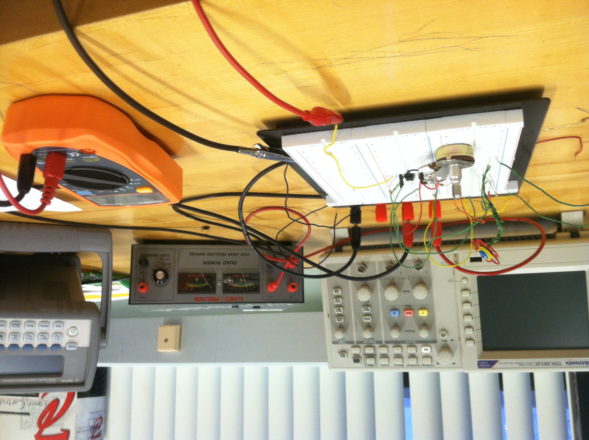
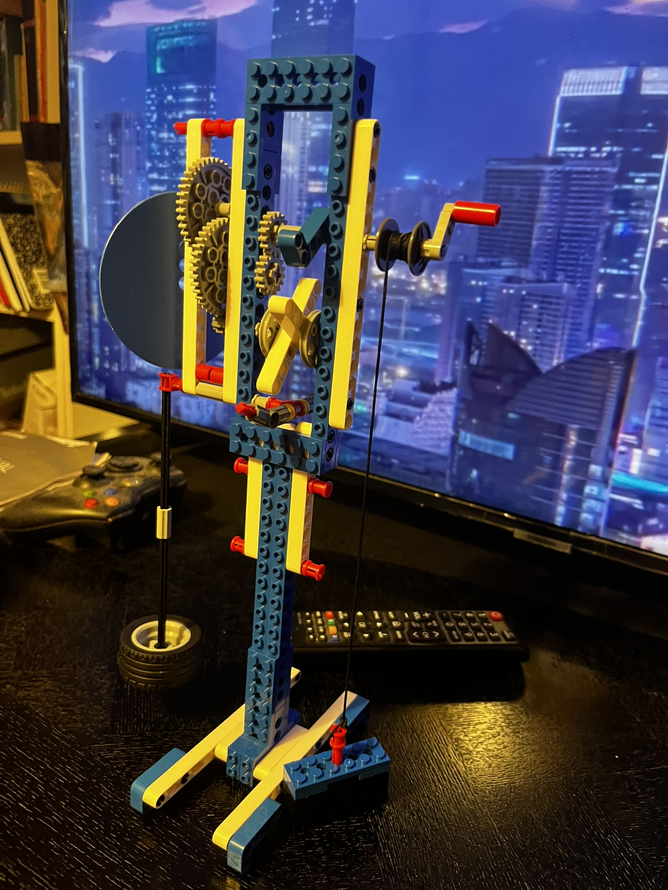

# Hardware-Notes

## Logisim-Evolution

<https://github.com/logisim-evolution/logisim-evolution> <--------- free

^^^^^^^^^^^ make a hypothetical CPU based on Digital Logic Design

## GPIO

## ESP


ESP32 是由 Espressif Systems 開發的低成本、低功耗微控制器系列，內建 Wi-Fi 和雙模藍牙功能。 Espressif 在 GitHub 上維護了多個與 ESP32 相關的開源項目，其中包括官方的 Arduino 核心庫和 IoT 開發框架。

**主要資源：**

- **Arduino 核心庫：** 此庫為 ESP32 系列（包括 ESP32、ESP32-S2、ESP32-S3、ESP32-C3、ESP32-C6 和 ESP32-H2）提供 Arduino 支持。 您可以在其 GitHub 頁面找到開發狀態、文檔、支持的芯片列表以及貢獻指南。

- **ESP-IDF（Espressif IoT 開發框架）：** 這是 Espressif SoC 的官方開發框架，支持 ESP32、ESP32-S2、ESP32-C3 等。 該框架提供詳細的設置、配置、構建、燒錄和監控 ESP-IDF 項目的指南。

- **ESP-AT：** 這是一個為 ESP32、ESP32-C2、ESP32-C3、ESP32-C6 和 ESP8266 提供 AT 指令支持的項目，方便將無線連接功能集成到新舊產品中。 

此外，GitHub 上還有許多與 ESP32 相關的公共倉庫，涵蓋固件、庫、工具和項目。 這些資源為開發者提供了豐富的選擇，以滿足不同的開發需求。

**時間點：** 2024 年 11 月 3 日，星期日，晚上 9:47:15（美國東部時間）

---

**修正後的用文的句子：**

ESP32 是由 Espressif Systems 開發的低成本、低功耗微控制器系列，內建 Wi-Fi 和雙模藍牙功能。 Espressif 在 GitHub 上維護了多個與 ESP32 相關的開源項目，其中包括官方的 Arduino 核心庫和 IoT 開發框架。

**主要資源：**

- **Arduino 核心庫：** 此庫為 ESP32 系列（包括 ESP32、ESP32-S2、ESP32-S3、ESP32-C3、ESP32-C6 和 ESP32-H2）提供 Arduino 支持。 您可以在其 GitHub 頁面找到開發狀態、文檔、支持的芯片列表以及貢獻指南。

- **ESP-IDF（Espressif IoT 開發框架）：** 這是 Espressif SoC 的官方開發框架，支持 ESP32、ESP32-S2、ESP32-C3 等。 該框架提供詳細的設置、配置、構建、燒錄和監控 ESP-IDF 項目的指南。

- **ESP-AT：** 這是一個為 ESP32、ESP32-C2、ESP32-C3、ESP32-C6 和 ESP8266 提供 AT 指令支持的項目，方便將無線連接功能集成到新舊產品中。 

此外，GitHub 上還有許多與 ESP32 相關的公共倉庫，涵蓋固件、庫、工具和項目。 這些資源為開發者提供了豐富的選擇，以滿足不同的開發需求。

**時間點：** 2024 年 11 月 3 日，星期日，晚上 9:47:15（美國東部時間）

---

**中文：**

ESP32 是由 Espressif Systems 開發的低成本、低功耗微控制器系列，內建 Wi-Fi 和雙模藍牙功能。 Espressif 在 GitHub 上維護了多個與 ESP32 相關的開源項目，其中包括官方的 Arduino 核心庫和 IoT 開發框架。

**主要資源：**

- **Arduino 核心庫：** 此庫為 ESP32 系列（包括 ESP32、ESP32-S2、ESP32-S3、ESP32-C3、ESP32-C6 和 ESP32-H2）提供 Arduino 支持。 您可以在其 GitHub 頁面找到開發狀態、文檔、支持的芯片列表以及貢獻指南。

- **ESP-IDF（Espressif IoT 開發框架）：** 這是 Espressif SoC 的官方開發框架，支持 ESP32、ESP32-S2、ESP32-C3 等。 該框架提供詳細的設置、配置、構建、燒錄和監控 ESP-IDF 項目的指南。

- **ESP-AT：** 這是一個為 ESP32、ESP32-C2、ESP32-C3、ESP32-C6 和 ESP8266 提供 AT 指令支持的項目，方便將無線連接功能集成到新舊產品中。 

此外，GitHub 上還有許多與 ESP32 相關的公共倉庫，涵 

## Arudino

C++

## Raspberry -Pi

## Screenshots








## Certainly! Here are some examples of open-source firmware projects and PCB designs that you can explore:

```markdown
**1. Marlin Firmware**

Marlin is an open-source firmware primarily designed for FDM (Fused Deposition Modeling) 3D printers using the Arduino platform. It's adaptable to various machine types, including CNC mills and laser engravers. The firmware is written in optimized C++ and can be built using tools like Arduino IDE and PlatformIO.

- **Repository:** [MarlinFirmware/Marlin on GitHub](https://github.com/MarlinFirmware/Marlin)

**2. QMK Firmware**

QMK (Quantum Mechanical Keyboard) is open-source firmware for microcontrollers that control computer keyboards. It allows for extensive customization of keyboard layouts, macros, and key functions. QMK is written in C and supports both Atmel AVR and ARM microcontrollers.

- **Repository:** [qmk/qmk_firmware on GitHub](https://github.com/qmk/qmk_firmware)

**3. ESP Easy**

ESP Easy is open-source firmware for ESP8266 and ESP32-based microcontroller units (MCUs) used in Internet of Things (IoT) applications. It enables these devices to function as multifunction sensors and actuators for home automation systems. Once flashed onto the hardware, ESP Easy can be configured via a web interface, eliminating the need for additional coding.

- **Repository:** [letscontrolit/ESPEasy on GitHub](https://github.com/letscontrolit/ESPEasy)

**4. Simon Says Kit**

The Simon Says kit is an open-source hardware memory game that teaches through-hole soldering basics. The firmware was developed in Arduino and the hardware design files are available in Eagle format.

- **Repository:** [sparkfun/Simon-Says on GitHub](https://github.com/sparkfun/Simon-Says)

**5. PCB Design Examples by Northwest Engineering Solutions**

Northwest Engineering Solutions has made several PCB design projects available for free download and reuse under a Creative Commons license. These designs can serve as practical examples for learning and reference.

- **Design Examples:** [PCB Design Examples](https://www.nwengineeringllc.com/resources/pcb-design-examples.php)

These resources provide practical examples of firmware and PCB designs, which can be valuable for learning and development purposes.

Prompt generation time: 2025-02-14 06:03:24 AM EST

Signed by ChatGPT 
```
