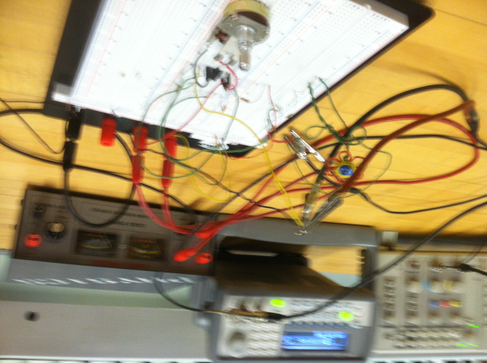

# Hardware-Notes

## Logisim-Evolution

<https://github.com/logisim-evolution/logisim-evolution> <--------- free

^^^^^^^^^^^ make a hypothetical CPU based on Digital Logic Design

## GPIO

## ESP

## Arudino

C++

## Raspberry -Pi

## Screenshots

